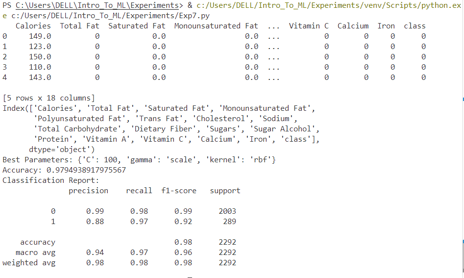
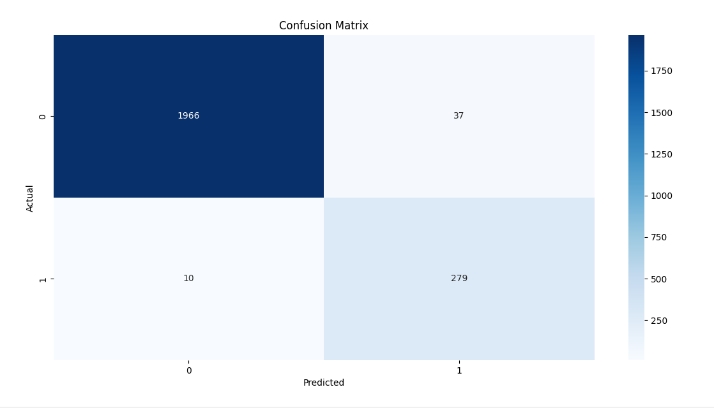

# Implementation of Support Vector Machine for Classifying Food Choices for Diabetic Patients

## AIM:
To implement a Support Vector Machine (SVM) model to classify food items and optimize hyperparameters for better accuracy.

## Equipments Required:
1. Hardware – PCs
2. Anaconda – Python 3.7 Installation / Jupyter notebook

## Algorithm
1. Data Loading
2. Data Exploration
3. Feature Selection
4. Data Splitting
5. Feature Scaling
6. Model Training with Hyperparameter Tuning
7. Model Evaluation

## Program:
```
/*
Program to implement SVM for food classification for diabetic patients.
Developed by: Vishwaraj G
RegisterNumber:  212223220125
*/
# Import necessary libraries
import pandas as pd
from sklearn.model_selection import train_test_split, GridSearchCV
from sklearn.preprocessing import StandardScaler
from sklearn.svm import SVC
from sklearn.metrics import accuracy_score, classification_report, confusion_matrix
import seaborn as sns
import matplotlib.pyplot as plt

# Step 1: Load the dataset from the URL
url = "https://cf-courses-data.s3.us.cloud-object-storage.appdomain.cloud/IBM-ML241EN-SkillsNetwork/labs/datasets/food_items_binary.csv"
data = pd.read_csv(url)

# Step 2: Data Exploration
# Display the first few rows and column names for verification
print(data.head())
print(data.columns)

# Step 3: Selecting Features and Target
# Define relevant features and target column
features = ['Calories', 'Total Fat', 'Saturated Fat', 'Sugars', 'Dietary Fiber', 'Protein']
target = 'class'  # Assuming 'class' is binary (suitable or not suitable for diabetic patients)

X = data[features]
y = data[target]

# Step 4: Splitting Data
X_train, X_test, y_train, y_test = train_test_split(X, y, test_size=0.3, random_state=42)

# Step 5: Feature Scaling
scaler = StandardScaler()
X_train = scaler.fit_transform(X_train)
X_test = scaler.transform(X_test)

# Step 6: Model Training with Hyperparameter Tuning using GridSearchCV
# Define the SVM model
svm = SVC()

# Set up hyperparameter grid for tuning
param_grid = {
    'C': [0.1, 1, 10, 100],         # Regularization parameter
    'kernel': ['linear', 'rbf'],     # Kernel types
    'gamma': ['scale', 'auto']       # Kernel coefficient for 'rbf'
}

# Initialize GridSearchCV
grid_search = GridSearchCV(svm, param_grid, cv=5, scoring='accuracy')
grid_search.fit(X_train, y_train)

# Extract the best model
best_model = grid_search.best_estimator_
print("Best Parameters:", grid_search.best_params_)

# Step 7: Model Evaluation
# Predicting on the test set using the best model
y_pred = best_model.predict(X_test)

# Calculate accuracy and print classification metrics
accuracy = accuracy_score(y_test, y_pred)
print("Accuracy:", accuracy)
print("Classification Report:\n", classification_report(y_test, y_pred))

# Confusion Matrix
conf_matrix = confusion_matrix(y_test, y_pred)
sns.heatmap(conf_matrix, annot=True, fmt="d", cmap="Blues")
plt.xlabel("Predicted")
plt.ylabel("Actual")
plt.title("Confusion Matrix")
plt.show()

```

## Output:


## Result:
Thus, the SVM model was successfully implemented to classify food items for diabetic patients, with hyperparameter tuning optimizing the model's performance.
